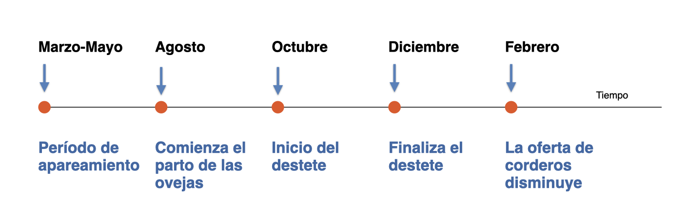
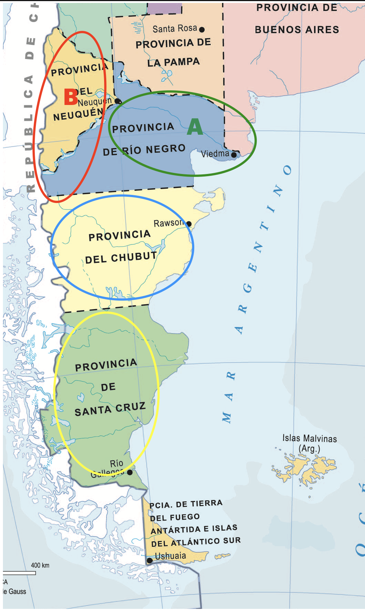
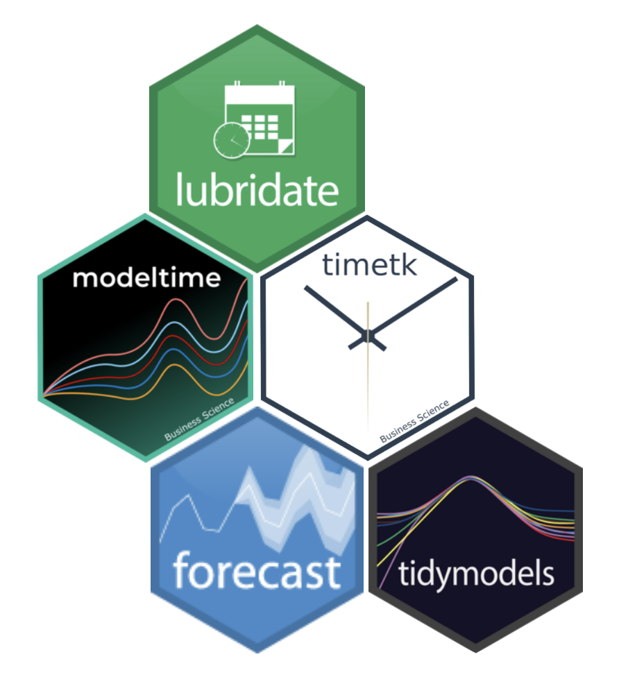
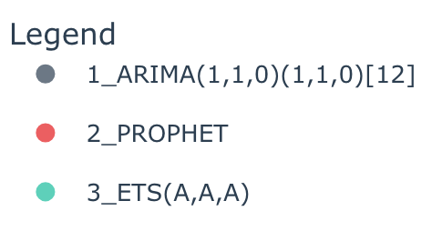
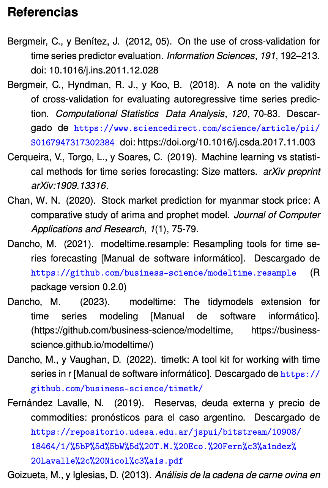
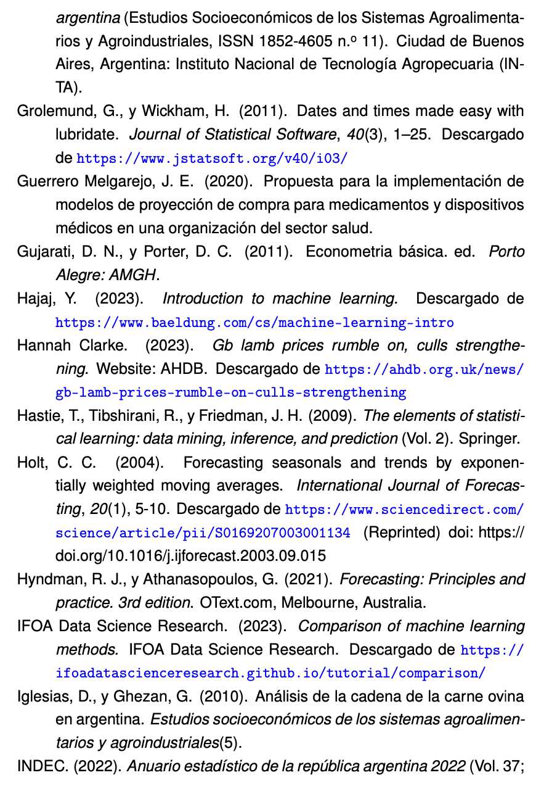
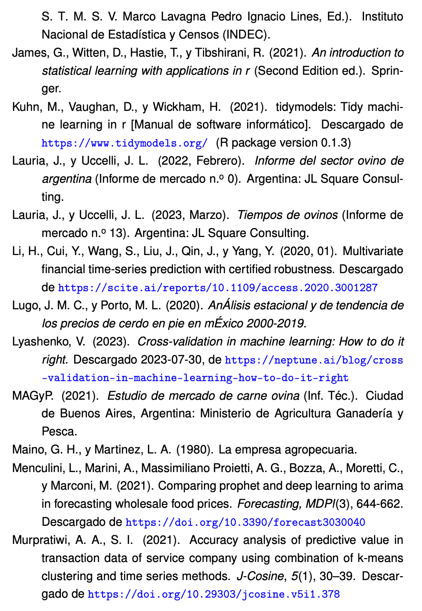
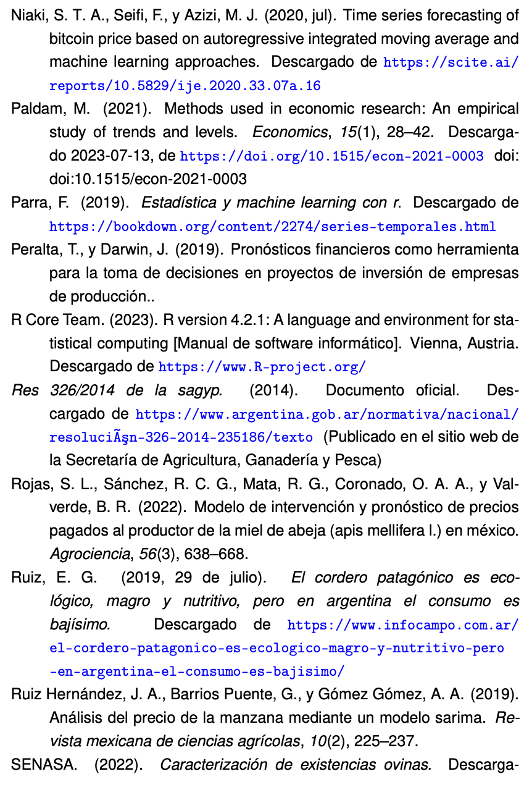
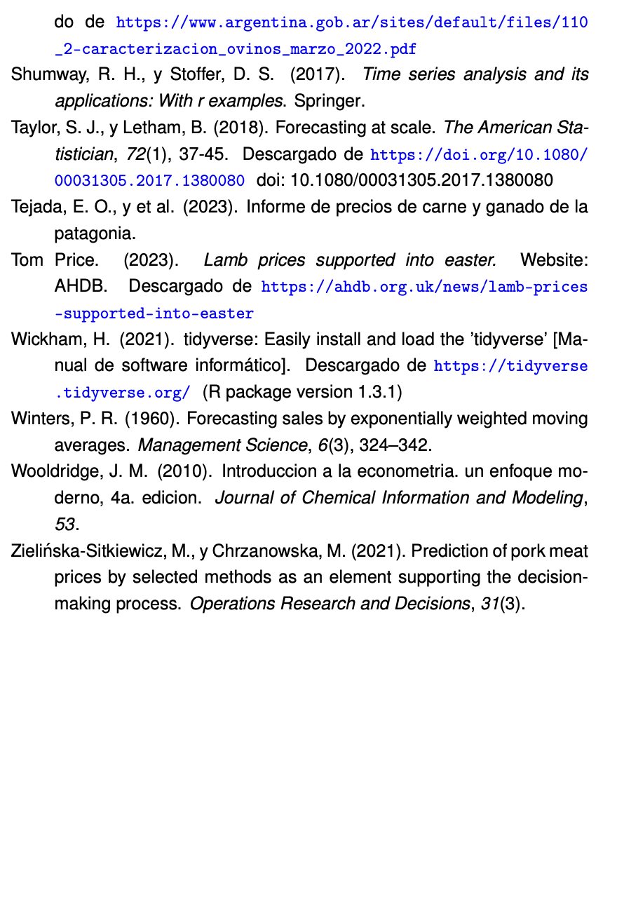
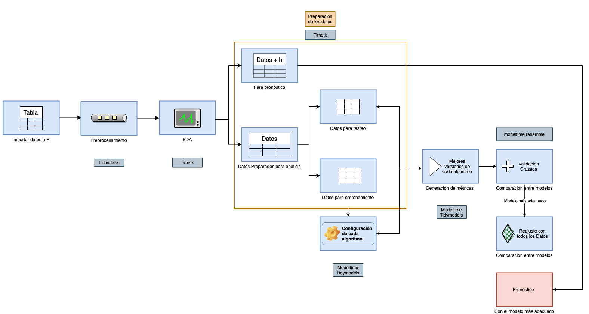

```{r setup, include=FALSE}
options(htmltools.dir.version = FALSE)
knitr::opts_chunk$set(
  fig.width=9, fig.height=6, fig.retina=3,
  out.width = "100%",
  cache = FALSE,
  echo = TRUE,
  message = FALSE, 
  warning = FALSE,
  hiline = TRUE
)
```

```{r xaringan-themer, include=FALSE, warning=FALSE}
library(xaringanthemer)
style_duo_accent(
  primary_color = "#3868A6",
  secondary_color = "#D5E7F2",
  inverse_header_color = "#004C85",
  base_font_size = "20px",
  text_font_size = "1.25rem",
  code_inline_color = "#000",
  code_inline_background_color = "#D5E7F2"
)

library(xaringanExtra)
use_xaringan_extra(
  c("tile_view", "panelset")
)
```

```{r, include=FALSE, warning=FALSE}
library(tidymodels)
library(modeltime)
library(tidyverse)
library(lubridate)
library(timetk)
library(forecast)
library(ggplot2)
library(prophet)
library(rstantools)
library(plotly)
library(modeltime.resample)

```

```{r xaringanExtra-clipboard, echo=FALSE}
xaringanExtra::use_clipboard()
```

```{r, echo=FALSE}
countdown::countdown(40, style = "z-index:100",
                     padding = "5px 7.5px",)
```

```{r xaringan-scribble, echo=FALSE}
xaringanExtra::use_scribble()
```

```{r xaringan-extra-styles, echo=FALSE}
xaringanExtra::use_extra_styles(
  hover_code_line = TRUE,         #<<
  mute_unhighlighted_code = TRUE  #<<
)
```

```{r xaringan-logo, echo=FALSE}
xaringanExtra::use_logo(
  image_url = "logos.png",
  position = css_position(bottom = "-3.5em", left = "0.7em")
)
```

```{r xaringan-tachyons, echo=FALSE}
xaringanExtra::use_tachyons()
```

---
## Introducción


<span style='font-size: 1.3em;'>&#128308; En este trabajo de tesis se exploraron técnicas de aprendizaje estadístico para detectar patrones y tendencias mediante distintos modelos y pronosticar la evolución del precio del cordero patagónico.</span>

--

<span style='font-size: 1.3em;'>&#128308; Para ello se contó con las series de tiempo presentadas en el Informe de Precios de Carne y Ganado de la Patagonia, publicado por los centros regionales Patagonia Norte y Patagonia Sur dependientes del INTA.</span>


---

## Por qué pronosticar el precio del cordero patagónico?
--




---
class: inverse center middle

# .red[Objetivos]
# &#127919;

---
class: center middle

### Principal
.b--dark-red.ba.bw2.br3.shadow-5.ph4.mt5[
## Desarrollar una metodología de pronóstico adecuada aplicable al precio del cordero patagónico, que permita prever con anticipación su evolución en el mercado.

.tr[

]]

---
class: middle

## Objetivos Específicos

- <span style='font-size: 1.3em;'>Realizar un análisis exploratorio de datos exhaustivo (EDA).</span>

- <span style='font-size: 1.3em;'>Examinar y evaluar los modelos de pronóstico elegidos.</span>

- <span style='font-size: 1.3em;'>Aplicar una metodología de validación cruzada adecuada para series temporales.</span>

- <span style='font-size: 1.3em;'>Realizar un pronóstico de 12 meses.</span>

- <span style='font-size: 1.3em;'>Proporcionar recomendaciones.</span>

---
class: inverse center middle

  
# .red[Descripción de la Metodología]
# &#128295;

---
## Metodología

.panelset[
.panel[.panel-name[Datos]
.pull-left[
- <span style='font-size: 1.2em;'>Cordero liviano de hasta 12 kilos para faena.</span>

- <span style='font-size: 1.2em;'>Este precio se consideró para cuatro regiones.</span>

- <span style='font-size: 1.2em;'>Análisis univariado: Precio Promedio del Cordero (PPCord) para las cuatro regiones.</span>

- <span style='font-size: 1.2em;'>Desde abril de 2014 a noviembre de 2023.</span>

]
.pull-right[


]
]
.panel[.panel-name[Librerías]

- Lenguaje de programación `R version 4.2.1`.

- `Tidymodels` (Max Kuhn & Hadley Wickhan), [https://www.tidymodels.org](https://www.tidymodels.org).

- `Lubridate` (Garrett Grolemund & Hadley Wickham), [https://www.jstatsoft.org/v40/i03/](https://www.jstatsoft.org/v40/i03/).

- `Timetk` (Matt Dancho & Davis Vaughan), [https://github.com/business-science/timetk](https://github.com/business-science/timetk).

- `Modeltime` (Matt Dancho), [https://github.com/business-science/modeltime](https://github.com/business-science/modeltime).

- `Forecast` (Rob Hyndman & George Athanasopoulos), [https://pkg.robjhyndman.com/forecast/](https://pkg.robjhyndman.com/forecast/).



]
.panel[.panel-name[Preparación]

&nbsp;

<span style='font-size: 1.2em;'>**Transformaciones**</span>

> Formato de fecha. Transformación logarítmica y estandarización de la serie.

<span style='font-size: 1.2em;'>**Horizonte de pronóstico:**</span>

> Se extendió la base de datos en 12 meses.

<span style='font-size: 1.2em;'>**Split o Partición:**</span>

> Se dividen los 117 datos: 80% para entrenamiento y 20% (más actual) para testeo. 

]
.panel[.panel-name[EDA]

&nbsp;

### Objetivo

<span style='font-size: 1.3em;'>&#128309; Asegurar que la serie esté en condiciones apropiadas para aplicar los procedimientos de pronóstico.</span>

<span style='font-size: 1.3em;'>&#128309; Examinar la estacionalidad, la presencia de datos anómalos y la estacionariedad.</span>


]
.panel[.panel-name[Modelos]

- <span style='font-size: 1.1em;'>ETS (*Exponential Time Smoothing*) &#9989;</span>

- <span style='font-size: 1.1em;'>ARIMA (*Autoregressive Integrated Moving Average*) &#9989;</span>

- <span style='font-size: 1.1em;'>Prophet (Algoritmo de Facebook) &#9989;</span>

- <span style='font-size: 1.1em;'>La mejor versión de cada algoritmo se eligió en función de su rendimiento en el grupo de testeo.</span>

- <span style='font-size: 1.1em;'>Métricas: MAE (*Mean Absolute Error*), MAPE (*Mean Absolute Percentage Error*) y RMSE (*Root Mean Squared Error*)</span>

]
.panel[.panel-name[Validación]

&nbsp;
1. <span style='font-size: 1.1em;'>**Validación Cruzada**: De origen fijo para el grupo de entrenamiento y ventana deslizante para el grupo de testeo. Número de particiones, (*k* = 5). Así la particion más pequeña contiene 43 observaciones y el grupo de prueba en cada partición contiene 24 observaciones.</span> 

1. <span style='font-size: 1.1em;'>Para medir el desempeño de cada modelo se evaluó, tanto el valor medio como la dispersión de cada una de las métricas empleadas (MAE, MAPE y RMSE).</span>


]
.panel[.panel-name[Pronóstico]

&nbsp;

- <span style='font-size: 1.3em;'>El output de la validación cruzada es el modelo más adecuado para el pronóstico.</span>

- <span style='font-size: 1.3em;'>Se reentrena ese modelo con el 100% de los datos.</span>

- <span style='font-size: 1.3em;'>Se realiza el pronóstico para 12 meses con sus respectivos intervalos de pronóstico.</span>

- <span style='font-size: 1.3em;'>Se vuelve al pronóstico a la escala original de la variable. &#128181;</span>

]
]

---
class: inverse center middle

# .red[Resultados]
# &#128200;

---
## Primera Visualización

.panelset[
.panel[.panel-name[PPCord]

```{r, include=FALSE, warning=FALSE}

data_tbl <- read_csv2("data_11_23.csv") 

data_tbl <- data_tbl %>% 
  mutate(Fecha = dmy(Mes)) %>% 
  select(-Mes)
```


```{r Fig1, eval= FALSE, echo= FALSE}
data_tbl %>% 
  plot_time_series(.date_var    = Fecha, 
                   .value       = PPCord,
                   .smooth      = FALSE,
                   .title       = "Precio Promedio del Cordero Patagónico",
                   .x_lab       = "Tiempo",
                   .y_lab       = "PPCord"
  )
```

```{r ref.label= "Fig1", echo= FALSE, fig.width=6, fig.height=5}
```
]

.panel[.panel-name[Log_PPCord]

```{r Fig2, eval= FALSE, echo= FALSE}

data_tbl %>% 
  plot_time_series(.date_var    = Fecha, 
                   .value       = log(PPCord),
                   .smooth      = FALSE,
                   .title       = "Logaritmo del Precio Promedio del Cordero Patagónico",
                   .x_lab       = "Tiempo",
                   .y_lab       = "Log_PPCord $"
  )
```

```{r ref.label= "Fig2", echo= FALSE, fig.width=7, fig.height=6}
```


]
]
---

## EDA
.panelset[
.panel[.panel-name[BP1]

```{r Fig3, eval= FALSE, echo= FALSE}
data_tbl %>% 
  plot_seasonal_diagnostics(.date_var     = Fecha,
                            .value        = log(PPCord),
                            .feature_set  = "month.lbl",
                            .title        = "Log PPCord - BoxPlot", 
                            .x_lab       = "Meses",
                            .y_lab       = "Log_PPCord"
  )
```

```{r ref.label= "Fig3", echo= FALSE, fig.width=6, fig.height=5}
```

]

.panel[.panel-name[BP2]

```{r Fig4, eval= FALSE, echo= FALSE}
data_tbl %>% 
  plot_seasonal_diagnostics(.date_var     = Fecha,
                            .value        = log(PPCord),
                            .feature_set  = "quarter",
                            .title        = "Log PPCord - BoxPlot",
                            .x_lab       = "Trimestres",
                            .y_lab       = "Log_PPCord"
  )
```

```{r ref.label= "Fig4", echo= FALSE, fig.width=6, fig.height=6}
```

]


.panel[.panel-name[Descomposición]

.center[<span style='font-size: 0.9em;'>STL: Seasonal-Trend Decomposition based on LoESS.</span>]

.pull-left[.center[
```{r Fig7, eval= FALSE, echo= FALSE}

data_tbl %>% 
  plot_stl_diagnostics(.date_var  = Fecha,
                       .value     = log(PPCord),
                       .frequency = "12 months",
                       .trend     = "1 year",
                       .feature_set = c("observed", "trend"),
                       .x_lab       = "",
                        .y_lab      = "Log_PPCord"
  )

```

```{r ref.label= "Fig7", echo= FALSE, fig.width=6, fig.height=7}
```
]
]

.pull-right[.center[

```{r Fig7bis, eval= FALSE, echo= FALSE}

data_tbl %>% 
  plot_stl_diagnostics(.date_var  = Fecha,
                       .value     = log(PPCord),
                       .frequency = "12 months",
                       .trend     = "1 year",
                       .feature_set = c("season", "remainder"),
                       .x_lab       = "",
                        .y_lab      = "Log_PPCord"
  )

```

```{r ref.label= "Fig7bis", echo= FALSE, fig.width=6, fig.height=7}
```

]
]

]


.panel[.panel-name[Anomalías]

```{r Fig6, eval= FALSE, echo= FALSE}
data_tbl %>% 
  plot_anomaly_diagnostics(.date_var      = Fecha,
                           .value         = log(PPCord),
                           .alpha         = 0.05, 
                           .max_anomalies = 0.2,
                           .title         = "Detección de Anomalías",
                           .x_lab       = "Tiempo",
                           .y_lab       = "Log_PPCord"
  )
```

```{r ref.label= "Fig6", echo= FALSE, fig.width=8, fig.height=8}
```


]


.panel[.panel-name[Correlograma]

```{r Fig8, eval= FALSE, echo= FALSE}
data_tbl %>% 
  plot_acf_diagnostics(.date_var              = Fecha,
                       .value                 = log(PPCord),
                       .lags                  = 24,
                       .show_white_noise_bars = TRUE
  )
```

```{r ref.label= "Fig8", echo= FALSE, fig.width=7, fig.height=8}
```

]
]
---

# Los modelos

```{r eval=TRUE, echo = FALSE}
data_transformed_tbl <- data_tbl %>% 
  mutate(log_PPCord = log(PPCord)) %>% 
  select(-PPCord)

st_mean <-mean(data_transformed_tbl$log_PPCord)
st_sd <-sd(data_transformed_tbl$log_PPCord)

data_transformed_tbl <- data_transformed_tbl %>% 
  mutate(PPCord_trans = standardize_vec(log_PPCord)) %>% 
  select(-log_PPCord)

horizon <- 12 
data_prepared_full_tbl <- data_transformed_tbl %>% 
  bind_rows(
    future_frame(.data = ., .date_var = Fecha, .length_out = horizon)
  )

data_prepared_tbl <- data_prepared_full_tbl %>% 
  filter(!is.na(PPCord_trans))

forecast_tbl <- data_prepared_full_tbl %>% 
  filter(is.na(PPCord_trans)) 

splits <- time_series_split(data_prepared_tbl, 
                    assess     = "24 months", 
                    cumulative = TRUE # para que trabaje con origen fijo
                    ) 
```


```{r eval =TRUE, echo=FALSE}
mod_fit_ets <- exp_smoothing(
  error  = "additive",
  trend  = "none",
  season = "none",
  smooth_level = 0.5 
) %>% 
  set_engine("ets") %>% 
  fit(PPCord_trans ~ Fecha, data = training(splits))

mod_fit_H <- exp_smoothing(
  error  = "additive",
  trend  = "additive",
  season =  "none",
  smooth_level = 0.5 
) %>% 
  set_engine("ets") %>% 
  fit(PPCord_trans ~ Fecha, data = training(splits))

mod_fit_HWS <- exp_smoothing(
  error  = "additive",
  trend  = "additive",
  season = "additive",
  smooth_level = 0.5 
) %>% 
  set_engine("ets") %>% 
  fit(PPCord_trans ~ Fecha, data = training(splits))
```

.panelset[

.panel[.panel-name[ETS]

.center[
$\hat{y}_{t+h|t} = \ell_t + h b_t + s_{t+h-m(k+1)}$
]

&#10102; Nivel:
.center[
$\ell_t = \alpha (y_t - s_{t-m}) + (1 - \alpha)(\ell_{t-1} + b_{t-1})$
]

&#10103; Tendencia:
.center[
$b_t = \beta(\ell_t - \ell_{t-1}) + (1 - \beta)b_{t-1}$
]

&#10104; Estacionalidad: 
.center[
$s_t = \gamma(y_t - \ell_t - b_{t-1}) + (1 - \gamma)s_{t-m}$

]
]

.panel[.panel-name[Plot]

```{r Fig10, eval= FALSE, echo= FALSE}
modeltime_table(
  mod_fit_ets,
  mod_fit_H,
  mod_fit_HWS
) %>% 
  modeltime_calibrate(testing(splits)) %>% 
  modeltime_forecast(
    new_data = testing(splits),
    actual_data = data_prepared_tbl
  ) %>% 
  plot_modeltime_forecast(.conf_interval_show = FALSE,
                          .title = NULL,
                          .x_lab = "",
                          .y_lab = "Log_PPCord_Std")
```

```{r ref.label= "Fig10", echo= FALSE, fig.width=8.5, fig.height=7.5}
```

]

.panel[.panel-name[Tbl]

### &#127894; Accuracy ETS 

```{r echo=FALSE}
accuracy_table <- modeltime_table(
  mod_fit_ets,
  mod_fit_H,
  mod_fit_HWS
) %>% 
  modeltime_calibrate(testing(splits)) %>% 
  modeltime_accuracy(metric_set = metric_set(mae, mape, rmse))
accuracy_table <- accuracy_table %>%
  mutate(across(where(is.numeric), ~ round(., 2)))
```

```{r echo=FALSE}
DT::datatable(
  accuracy_table,
  options = list(
    pageLength = 3, 
    autoWidth = TRUE,
    dom = 't',
    searching = FALSE
    )
)
```

]

.panel[.panel-name[ARIMA]


.center[
$ARIMA(p, d, q)(P, D, Q)_m$
]

&#10149; Parte Autorregresiva

.center[
$Y_t = c + \sum_{i=1}^{p} \phi_i Y_{t-i} + \sum_{i=1}^{P} \Phi_i Y_{t-im} + \epsilon_t$
]

&#10149; Parte Integrada

.center[
$\Delta^d \Delta_m^D Y_t = (1 - B)^d (1 - B^m)^D Y_t = \epsilon_t$
]

&#10149; Parte de Promedio Móvil 

.center[
$Y_t = c + \epsilon_t + \sum_{i=1}^{q} \theta_i \epsilon_{t-i} + \sum_{i=1}^{Q} \Theta_i \epsilon_{t-im}$
]

]

.panel[.panel-name[Plot]
```{r eval =TRUE, echo=FALSE}
mod_fit_autoarima <- arima_reg() %>% 
  set_engine("auto_arima") %>% 
  fit(
    PPCord_trans ~ Fecha ,
    data = training(splits)
  )

mod_fit_arima <- arima_reg(
  non_seasonal_ar = 1, 
  non_seasonal_differences = 1,
  seasonal_period = 12,
  seasonal_ar = 1,
  seasonal_differences = 1,
  seasonal_ma = 0
  ) %>% 
  set_engine("arima") %>% 
  fit(PPCord_trans ~ Fecha, training(splits))

```

```{r Fig11, eval= FALSE, echo= FALSE}
modeltime_table(
  mod_fit_autoarima,
  mod_fit_arima
) %>% 
  modeltime_calibrate(testing(splits)) %>% 
  modeltime_forecast(
     new_data    = testing(splits),
     actual_data = data_prepared_tbl
  ) %>% 
  plot_modeltime_forecast(.conf_interval_show = FALSE,
                          .title = NULL,
                          .x_lab = "",
                          .y_lab = "Log_PPCord_Std")
```

```{r ref.label= "Fig11", echo= FALSE, fig.width=8.5, fig.height=7.5}
```

]

.panel[.panel-name[Tbl]

### &#127894; Accuracy ARIMA

```{r echo=FALSE}
accuracy_table <- modeltime_table(
  mod_fit_autoarima,
  mod_fit_arima
) %>% 
  modeltime_calibrate(testing(splits)) %>% 
  modeltime_accuracy(metric_set = metric_set(mae, mape, rmse))
accuracy_table <- accuracy_table %>%
  mutate(across(where(is.numeric), ~ round(., 3))) 
```

```{r echo=FALSE}
DT::datatable(
  accuracy_table,
  options = list(
    pageLength = 3, 
    autoWidth = TRUE,
    dom = 't',
    searching = FALSE
    )
)
```

]

.panel[.panel-name[Prophet]

&nbsp;
$$Y(t)=g(t)+s(t)+h(t)+\epsilon_t$$
&#10003; Tendencia:
$$g(t) = (k + \sum_{i:t>s_i} \delta_i) t + (m + \sum_{j:t>s_j} \gamma_j)$$
&#10003; Estacionalidad:
$$s(t) = \sum_{n=1}^{N} \left[ \beta_n \cos\left( \frac{2\pi n t}{P} \right) + \gamma_n \sin\left( \frac{2\pi n t}{P} \right) \right]$$

]
.panel[.panel-name[Plot]

```{r eval =TRUE, echo=FALSE}
mod_fit_prophet <- prophet_reg() %>% 
  set_engine("prophet") %>% 
  fit(PPCord_trans ~ Fecha, data = training(splits))

mod_fit_prophetP <- prophet_reg(
  changepoint_num = 4, 
  prior_scale_changepoints = 0.1,#
  changepoint_range = 0.95,  
  seasonality_yearly = TRUE 
) %>% 
  set_engine("prophet") %>% 
  fit(PPCord_trans ~ Fecha, 
      data = training(splits))
```

```{r Fig12, eval= FALSE, echo= FALSE}
modeltime_table(
  mod_fit_prophet,
  mod_fit_prophetP
) %>% 
  modeltime_calibrate(new_data = testing(splits)) %>% 
  modeltime_forecast(
    new_data    = testing(splits),
    actual_data = data_prepared_tbl
  ) %>% 
  plot_modeltime_forecast(.conf_interval_show = FALSE,
                          .title = NULL,
                          .x_lab = "",
                          .y_lab = "Log_PPCord_Std")

```


```{r ref.label= "Fig12", echo= FALSE, fig.width=8.5, fig.height=7.5}
```

]

.panel[.panel-name[Tbl]

### &#127894; Accuracy PROPHET

```{r echo=FALSE}
accuracy_table <- modeltime_table(
  mod_fit_prophet,
  mod_fit_prophetP
) %>% 
  modeltime_calibrate(testing(splits))%>% 
  modeltime_accuracy(metric_set = metric_set(mae, mape, rmse))

accuracy_table <- accuracy_table %>%
  mutate(across(where(is.numeric), ~ round(., 3))) 
```

```{r echo=FALSE}
DT::datatable(
  accuracy_table,
  options = list(
    pageLength = 3, 
    autoWidth = TRUE,
    dom = 't',
    searching = FALSE
    )
)
```

]
]

---
## Validación Cruzada
.panelset[

```{r echo=FALSE}
resamples_tscv_lags <- time_series_cv(
  data = training(splits), 
  cumulative = TRUE,
  assess = "24 month",
  skip = "6 month",
  slice_limit = 5
)
```

.panel[.panel-name[Plan]

```{r Fig13, eval= FALSE, echo= FALSE}
resamples_tscv_lags %>% 
  tk_time_series_cv_plan() %>% 
  plot_time_series_cv_plan(Fecha, PPCord_trans,
                           .facet_ncol = 2,
                           .x_lab = "",
                           .y_lab = "Log_PPCord_Std")
```

```{r ref.label= "Fig13", echo= FALSE, fig.width=8, fig.height=6.2}
```

]

.panel[.panel-name[CV]

```{r echo=FALSE, message = FALSE, warning = FALSE, results = "hide"}
model_tbl <- modeltime_table(
  mod_fit_arima,
  mod_fit_prophetP,
  mod_fit_HWS
)

model_resamples_tbl <- model_tbl %>% 
  modeltime_fit_resamples(
    resamples = resamples_tscv_lags,
    control =  control_resamples(verbose = TRUE, allow_par = TRUE)
  )

model_resamples_tbl %>% 
  modeltime_resample_accuracy(metric_set  = metric_set(mae, mape, rmse),
                              summary_fns = list(mean = mean, sd = sd)
                              ) %>% 
  arrange(mae_mean)
```

```{r Fig14, eval= FALSE, echo= FALSE, message = FALSE, warning = FALSE, results = "hide"}
model_resamples_tbl %>% 
  plot_modeltime_resamples(
    .metric_set = metric_set(mae, mape, rmse),
    .point_size = 2,
    .point_alpha = 0.70,
    .facet_ncol = 3,
    .legend_show = FALSE
  )
```

```{r ref.label= "Fig14", echo= FALSE, fig.width=14, fig.height=6.5}
```



     
]

.panel[.panel-name[Medias]

### &#129345; Media de las métricas

```{r echo=FALSE}
table_mean <- model_resamples_tbl %>% 
  modeltime_resample_accuracy(
        metric_set  = metric_set(mae, mape, rmse),
        summary_fns = list(mean = mean))
table_mean <- table_mean %>%
  mutate(across(where(is.numeric), ~ round(., 3)))                              
```

```{r echo=FALSE}
DT::datatable(
  table_mean,
  options = list(
    pageLength = 3, 
    autoWidth = TRUE,
    dom = 't',
    searching = FALSE
    ),
  class = 'display compact' 
)
```

]
.panel[.panel-name[Desvíos Estándar]

### &#129345; Desvío Estándar de las métricas

```{r echo=FALSE}
table_sd <- model_resamples_tbl %>% 
  modeltime_resample_accuracy(
      metric_set  = metric_set(mae, mape, rmse),
      summary_fns = list(sd = sd))
table_sd <- table_sd %>%
  mutate(across(where(is.numeric), ~ round(., 3)))              
```


```{r echo=FALSE}
DT::datatable(
  table_sd,
  options = list(
    pageLength = 3, 
    autoWidth = TRUE,
    dom = 't',
    searching = FALSE
    ),
  class = 'display compact' 
)
```

]
]

---

## Pronóstico

```{r echo=FALSE}
calibration_tbl <- modeltime_table(
  mod_fit_arima) %>% 
  modeltime_calibrate(testing(splits))

refit_tbl <- calibration_tbl %>% 
  modeltime_refit(data_prepared_tbl)
```

Se actualizó el modelo ARIMA(1,1,0)(1,1,0)[12], con el 100% de las observaciones. Y se realiza el pronóstico para 12 meses.

```{r Fig15, eval= FALSE, echo= FALSE}
refit_tbl %>% 
  modeltime_forecast(
    new_data    = forecast_tbl,
    actual_data = data_prepared_tbl
  ) %>% 
  plot_modeltime_forecast(.title = NULL,
                          .y_lab = "Log_PPCord_Std")
```

```{r ref.label= "Fig15", echo= FALSE, fig.width=12, fig.height=6}
```

---

## Los valores pronosticados en pesos &#128171; 

```{r echo=FALSE}

pesos_tbl <- tibble(
  Período = c("2023-12", "2024-01", "2024-02", "2024-03", "2024-04", 
              "2024-05", "2024-06", "2024-07", "2024-08", "2024-09", 
              "2024-10", "2024-11"),
  PPCord = c(2729, 2772, 2846, 2913, 2948, 
                      3141, 3536, 4066, 4442, 4782, 
                      5098, 5653),
  L_Inferior = c(1764, 1792, 1840, 1883, 1906, 
                      2031, 2286, 2628, 2872, 3092, 
                      3296, 3655),
  L_Superior = c(4221, 4288, 4402, 4505, 4560, 
                      4859, 5470, 6289, 6872, 7397, 
                      7886, 8744)
)

```


```{r echo=FALSE}
DT::datatable(
  pesos_tbl,
  options = list(
    pageLength = 12, 
    autoWidth = TRUE,
    dom = 't',
    searching = FALSE
    ),
  class = 'display compact' 
)
```

---

class: inverse center middle

# .red[Discusión]
# &#128483;

---

> Hay una tendencia a abordar el pronóstico de los precios mediante el uso de un modelo en particular que se compara contra un modelo de referencia. 

Rojas y cols.(2022); Zielińska-Sitkiewicz y Chrzanowska (2021) y Ruiz Hernandez y cols. (2019).

--

> Otro enfoque, como el utilizado en esta tesis, consiste en permitir que los modelos "compitan" entre sí.

Menculini y cols(2021); Fernandez Lavalle (2019); Chan (2020)

--

> No todos los autores realizan un EDA, que es una fase esencial para comprender la naturaleza de la serie y evaluar la calidad de los datos.

Chan (2020), Fernandez Lavalle (2019), Lugo y Porto (2020)

--

> En general, no se contempla la adaptabilidad de los modelos a contextos variables, lo que puede limitar su uso a largo plazo. 

---

> Aunque se han empleado técnicas robustas como la validación cruzada, el tamaño de muestra utilizado se puede considerar pequeño y limitar el alcance de los resultados. 

Cequeira, Torgo y Soares (2019); 

--

> La efectividad de un modelo (ARIMA) puede disminuir o ser supera por otro, en momentos diferentes de la serie. Lo que implica la necesidad de evaluación continua y reentrenamiento periódico.

Hyndman y Athanasopoulos (2021)

--

> La técnica de validación cruzada adoptada, con inicio fijo y ventana deslizante de testeo, es recomendada cuando es necesario el reentrenamiento periódico pero puede ser exigente en términos computacionales.

Bergmeir y Benitez (2012)

---
class: inverse center middle

# .red[Conclusiones]
# &#128017;

---
class: middle highlight-last-item

```{css echo=FALSE}
.highlight-last-item > ul > li,
.highlight-last-item > ol > li {
  opacity: 0.5;
}
.highlight-last-item > ul > li:last-of-type,
.highlight-last-item > ol > li:last-of-type {
  opacity: 1;
}
```


- <span style='font-size: 1.2em;'>Se desarrolló una metodología dinámica y adaptable de pronóstico, aplicada al precio del cordero patagónico.</span>

--

- <span style='font-size: 1.2em;'>El análisis exploratorio de datos permitió identificar patrones estacionales, tendencias y cambios estructurales suceptibles de ser modelizados.</span>

--

- <span style='font-size: 1.2em;'>Se examinaron, implementaron y evaluaron modelos del campo de la econometría (ARIMA, ETS) y del aprendizaje automático (Prophet).</span>

--

- <span style='font-size: 1.2em;'>El trabajo reveló que el modelo ARIMA, demostró ser efectivo en el contexto de los datos disponibles.</span>

---
class: middle highlight-last-item

```{css echo=FALSE}
.highlight-last-item > ul > li,
.highlight-last-item > ol > li {
  opacity: 0.5;
}
.highlight-last-item > ul > li:last-of-type,
.highlight-last-item > ol > li:last-of-type {
  opacity: 1;
}
```


- <span style='font-size: 1.2em;'>La validación cruzada no solo determinó cual era el modelo más eficaz, sino que también destacó la importancia crítica del reentrenamiento periódico.</span>

--

- <span style='font-size: 1.2em;'>Permitió observar cómo la eficiencia de los diferentes modelos pude fluctuar con la incorporación de los nuevos datos.</span>

--

- <span style='font-size: 1.2em;'>También subrayó que la superioridad de un modelo es condicional y puede variar con el tiempo.</span>

--

- <span style='font-size: 1.2em;'> Y propició deducir que la repetición periódica de la metodología propuesta, es una práctica escencial a fin de garantizar pronósticos actualizados y alineados a las condiciones del mercado.</span>  

---
class: inverse center middle

# .red[Proyecciones]
# &#127959;

---
class: middle highlight-last-item

```{css echo=FALSE}
.highlight-last-item > ul > li,
.highlight-last-item > ol > li {
  opacity: 0.5;
}
.highlight-last-item > ul > li:last-of-type,
.highlight-last-item > ol > li:last-of-type {
  opacity: 1;
}
```

1. <span style='font-size: 1.3em;'>Técnicas de validación cruzada alternativas para series temporales.</span>  

--

2. <span style='font-size: 1.3em;'>Técnicas de validación cruzada aplicada a series temporales multivariadas.</span>  

--

3. <span style='font-size: 1.3em;'>Redes Neuronales Recurrentes y Long Short-Term Memory, más adecuados para manejo de series de largo plazo y con mayor capacidad para capturar patrones complejos.</span>  

--

4. <span style='font-size: 1.3em;'>Empleo de Modelos Híbridos.

--

5. <span style='font-size: 1.3em;'>Modelos basados en Ensemble.</span>  

---
class: inverse center middle

# .red[Referencias]
# &#128218;

---
.pull-left[

]

.pull-right[

]
---

.pull-left[

]

.pull-right[

]
---

.pull-left[

]


---

class: center, middle

# Muchas Gracias!
# &#128524;

---

---
.red[Workflow]

 


---
## Aportes de esta Tesis

**Teóricos**

>Enriquecimiento del aprendizaje estadístico, proporcionando una visión comparativa y dinámica de modelos de pronóstico, aplicados a datos económicos de tipo temporales.

**Metodológicos**

>Desarrollo de una metodología de pronóstico replicable, proponiendo un flujo de trabajo detallado que pueda ser aplicado y adaptado a contextos similares.

**Prácticos**

>Optimización de la planificación productiva, ofreciendo una metodología de pronóstico a los agentes del sector para tomar decisiones informadas y estratégicas.

---


```{r Fig5, eval= FALSE, echo= FALSE}
data_tbl %>% 
  plot_seasonal_diagnostics(.date_var     = Fecha,
                            .value        = log(PPCord),
                            .feature_set  = "year",
                            .title        = "Log PPCord - BoxPlot",
                            .x_lab       = "Años",
                            .y_lab       = "Log_PPCord"
  )
```

```{r ref.label= "Fig5", echo= FALSE, fig.width=6, fig.height=6}
```

---


```{r Fig9, eval= FALSE, echo= FALSE}
splits %>% 
  tk_time_series_cv_plan() %>% 
  plot_time_series_cv_plan(Fecha, PPCord_trans,
                           .title = NULL,
                           .x_lab = "",
                           .y_lab = "Log_PPCord_Std")
```

```{r ref.label= "Fig9", echo= FALSE, fig.width=5, fig.height=6}
```


